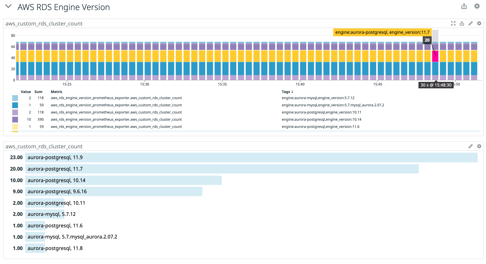

# aws-rds-engine-version-prometheus-exporter
Prometheus Exporter for AWS RDS Engine Version



## How to run

### Local

```
$ go run main.go
```

### Binary

Get the binary file from [Releases](https://github.com/chaspy/aws-rds-engine-version-prometheus-exporter/releases) and run it.

### Docker

```
$ docker run chaspy/aws-rds-engine-version-prometheus-exporter:v0.1.0
```

## Metrics

```
$ curl -s localhost:8080/metrics | grep aws_custom_rds_cluster_count
# HELP aws_custom_rds_cluster_count Number of RDS
# TYPE aws_custom_rds_cluster_count gauge
aws_custom_rds_cluster_count{cluster_identifier="api-postgres-develop-a",engine="aurora-postgresql",engine_version="10.7",eol_status="ok"} 1
aws_custom_rds_cluster_count{cluster_identifier="api-postgres-production-a",engine="aurora-postgresql",engine_version="10.7",eol_status="ok"} 1
aws_custom_rds_cluster_count{cluster_identifier="video-production-a",engine="aurora-postgresql",engine_version="9.6.17",eol_status="ok"} 1
aws_custom_rds_cluster_count{cluster_identifier="video-staging-a",engine="aurora-postgresql",engine_version="9.6.17",eol_status="ok"} 1
```

## IAM Role

The following policy must be attached to the AWS role to be executed.

```json
{
    "Version": "2012-10-17",
    "Statement": [
        {
            "Sid": "VisualEditor0",
            "Effect": "Allow",
            "Action": [
                "rds:DescribeDBInstances",
                "rds:DescribeDBClusters"
            ],
            "Resource": "*"
        }
    ]
}
```

## Datadog Autodiscovery

If you use Datadog, you can use [Kubernetes Integration Autodiscovery](https://docs.datadoghq.com/agent/kubernetes/integrations/?tab=kubernetes) feature.


